# Implantación de dos BD con MariaDB

Tras las exlicaciones de DDL y DML poniendo un ejemplo de la creación de una base de datos en ElephantSQL, ahora toca la implementación de otras dos bases de datos en MariaSQL que ya enseñé como instalarlo de forma local a través de la línea de comandos en Ubuntu.  

Tras documentarme me di cuenta de que **en MariaSQL no existe lo que en ElephantSQL se denomina "dominio"**, por lo que en este SGBD tendremos que poner el dominio de los atributos constantemente sin poder usar una "variable". Y también a las sentencias válidas para la creación de la base de datos les puse una línea blanca para marcar que están bien hechas.  

## Base de datos número 1: Proxectos de investigación

[Esquema de la base de datos](https://github.com/davidgchaves/first-steps-with-git-and-github-wirtz-asir1-and-dam1/tree/master/exercicios-ddl/1-proxectos-de-investigacion)
Primero crearemos la base de datos con ```CREATE SCHEMA ProxectosInvestigacion;``` y posteriormente, entrar en la BD con ```USE ProxectosInvestigacion``` o en lugar de USE usar lo que se ve en la imagen **\u**. También hay que aclarar que para está base de datos decidí crear todas las tablas primero sin ninguna propagación de clave foránea, y después cuando estén todas las tablas ya creadas, crearé las interrelaciones alterando la tabla con **ALTER**.

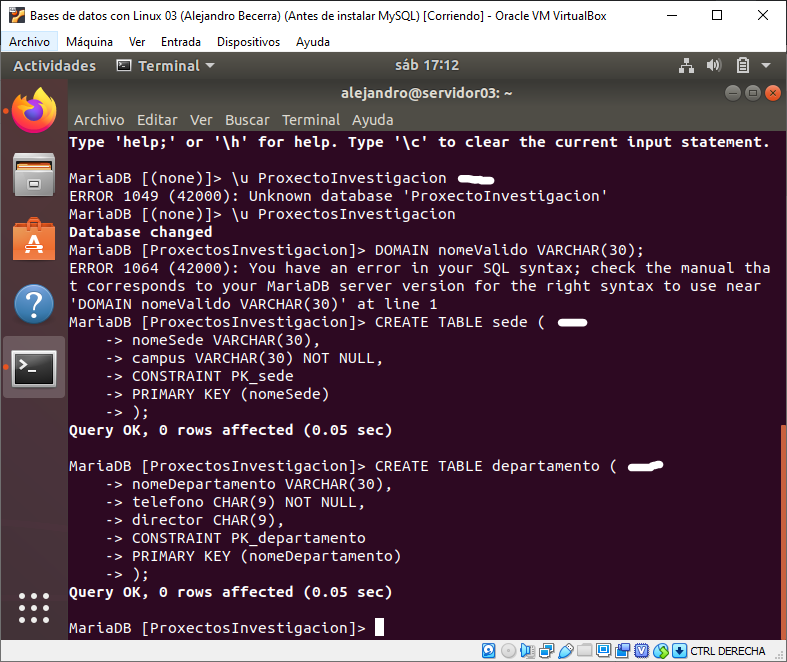

Crearemos las tablas **ubicación** y **grupo**.  
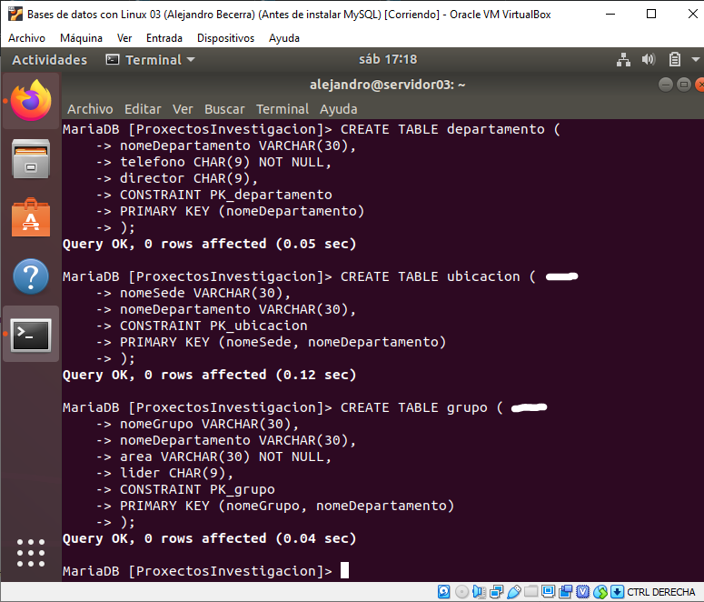

Después **profesor**.  
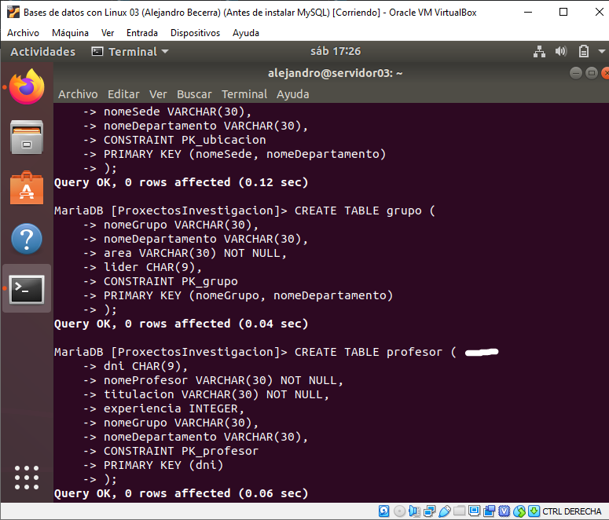

Luego, corrigiendo un fallo que tuve crearemos **proxecto**.  
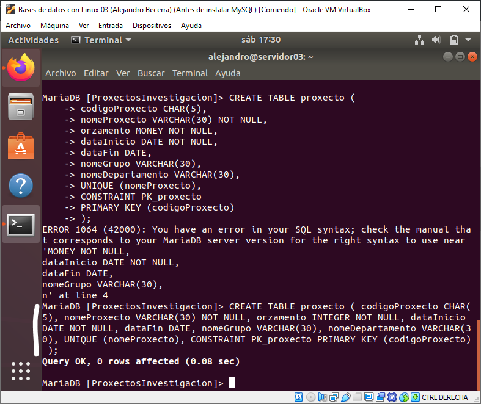

A continuación **pariticipa** y **proxecto**.  
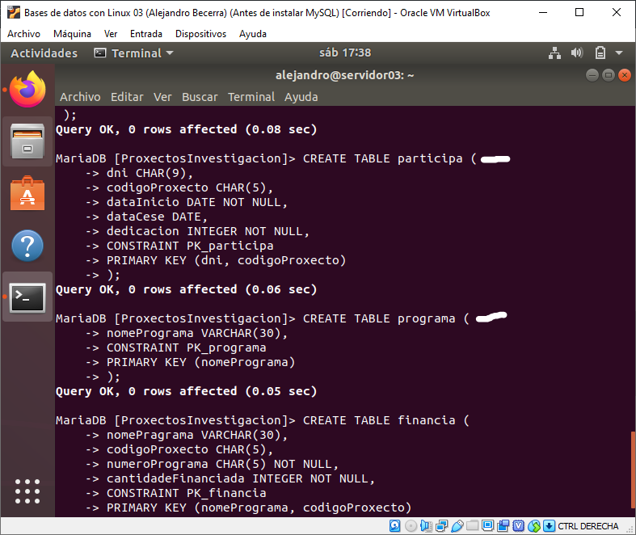

Después, volviendo a tener otro error al escribir los valores, creamos la tabla **financia**.  
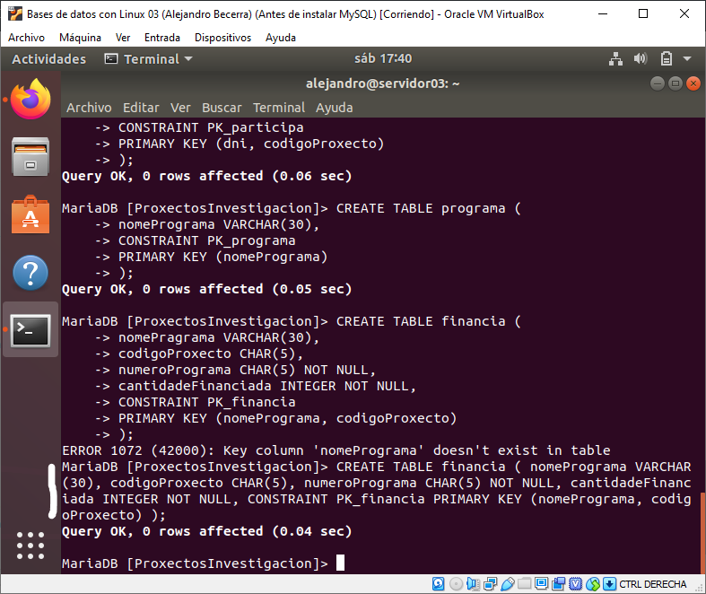

Y a partir de aquí comenzaremos con las alteraciones de las tablas para crear las interrelaciones, comenzaremos con las tablas **ubicación**, y **grupo**.  
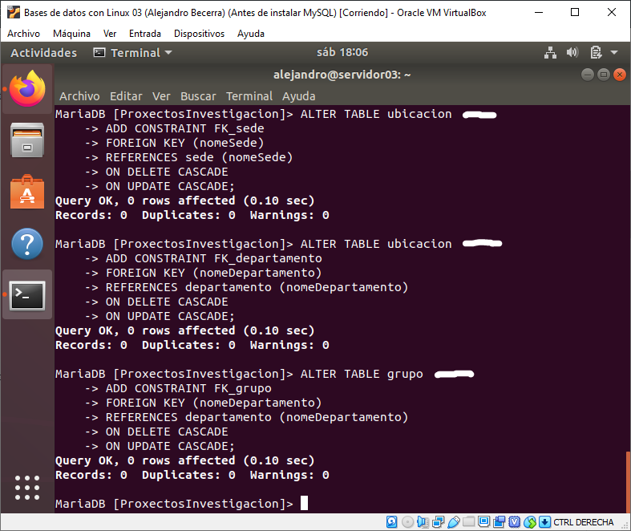

Despueés alteramos **profesor** y **proxecto**.  
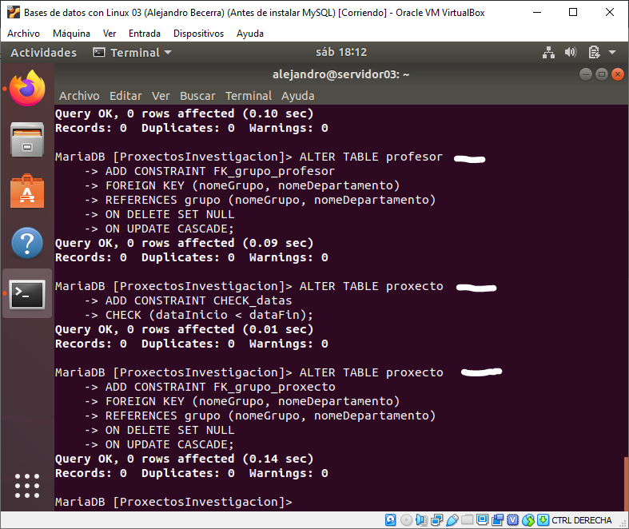

Luego **departamento**, **grupo** y **participa**.  
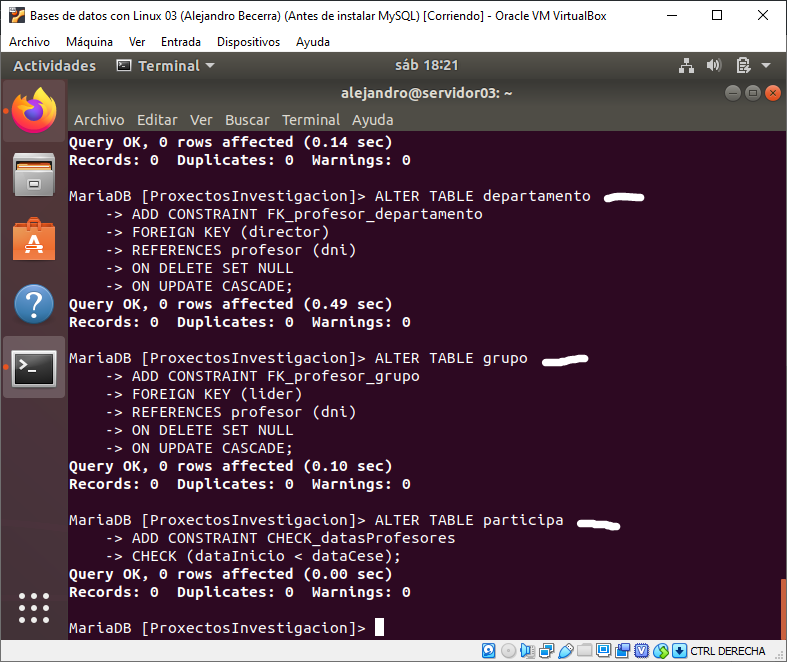

Volvemos alterar **participa**.  
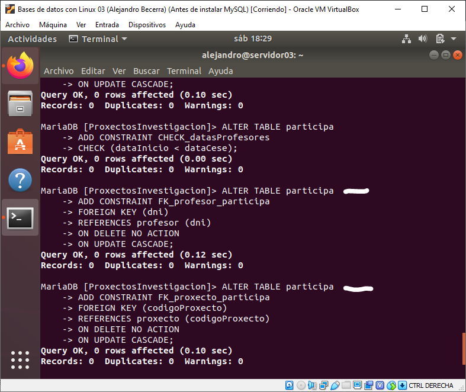

Y por último alteramos **financia** y ya tenemos la base de datos con la implementación terminada.  
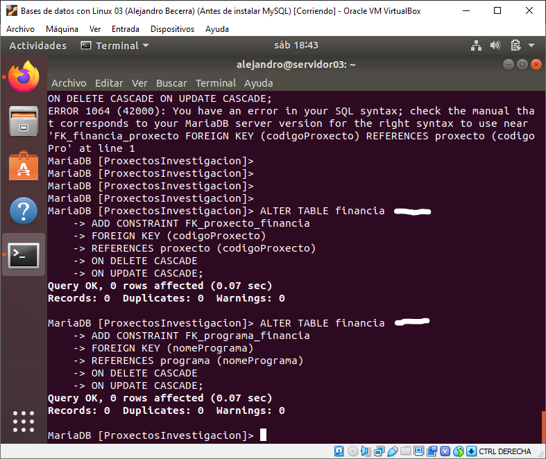  

## Base de datos número 2: Naves espaciais

[Esquema de la base de datos](https://github.com/davidgchaves/first-steps-with-git-and-github-wirtz-asir1-and-dam1/tree/master/exercicios-ddl/2-naves-espaciais)
Y para la creación de esta base de datos, lo haremos sin marcar ninguna CONSTRAINT y procurando siempre que sea posible hacer la interrelación entre tablas a la vez que creemos la tabla en cuestión.  

Aquí comenzaremos iniciando el programa, creando la base de datos, usandola con ```USE <nombreDeLaBD>;``` y creando la primera tabla con el nombre de **servizo**.  
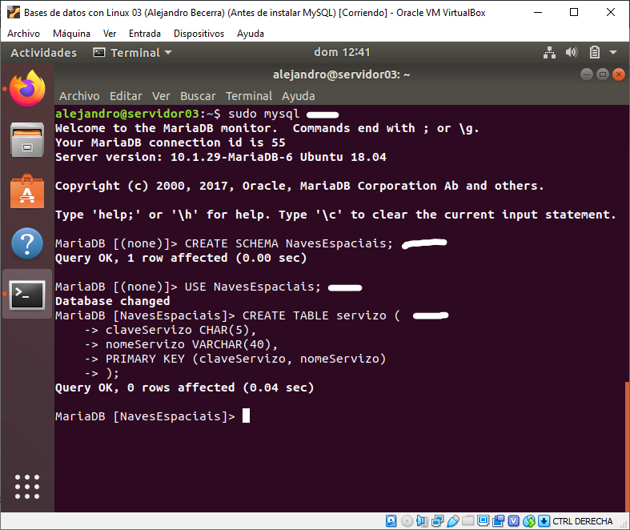

A continuación crearemos **dependenia**.  
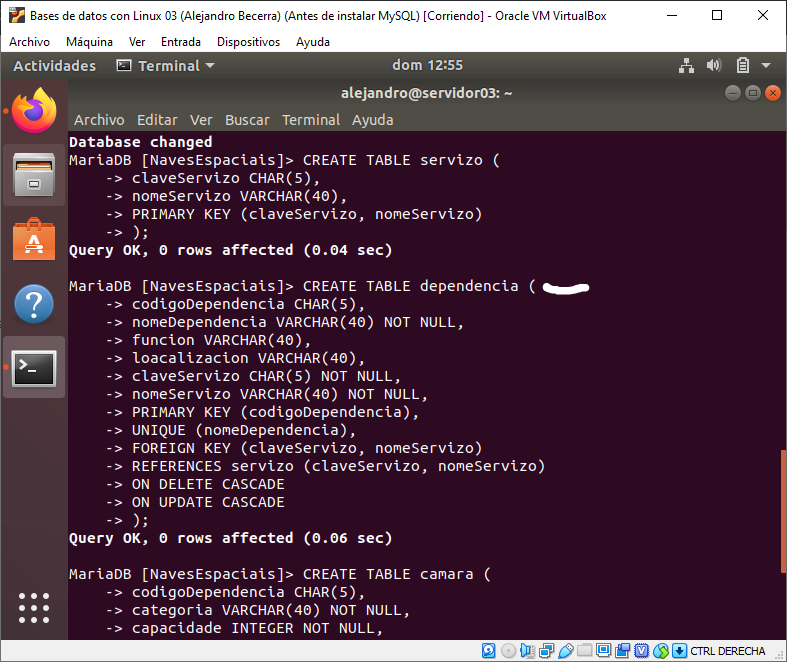

Luego **cámara**.  
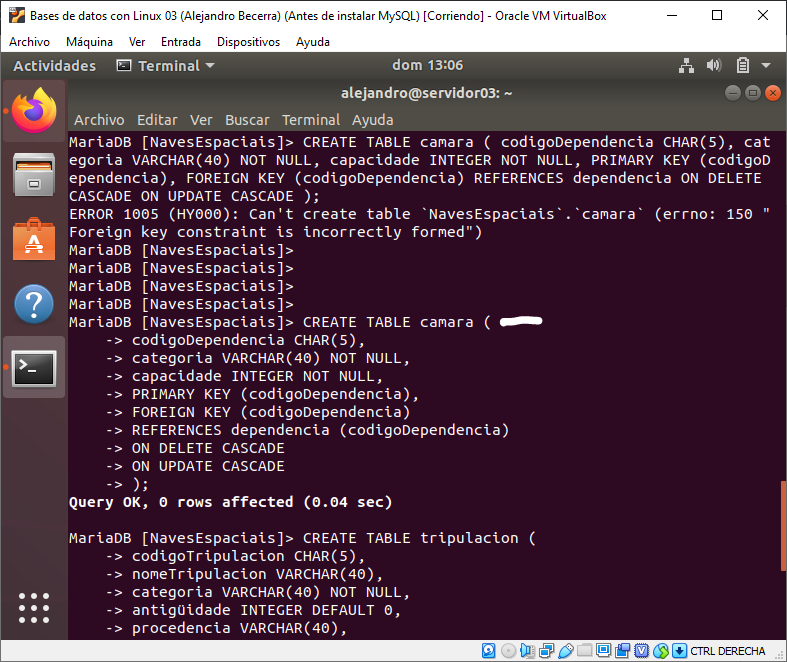

Después crearemos **tripulación** y la alteraremos porque se me olvidó hacer una interrelación.  
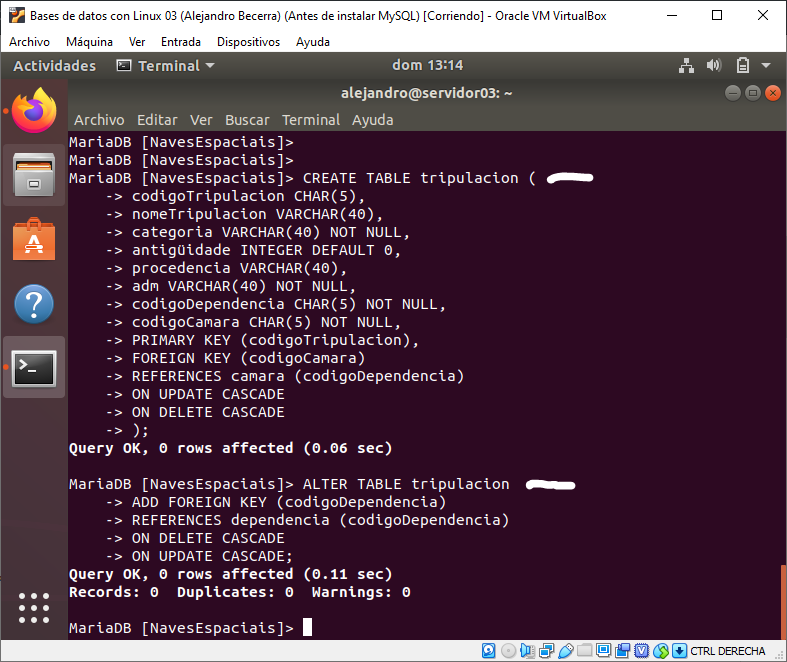

Corregiremos el fallo que tuve a la hora de escribir la tabla **planeta** y crearemos también la tabla **visita**.
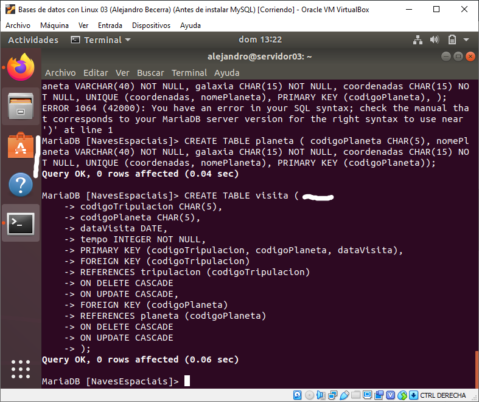

Ahora craremos las tablas **habita** y **raza**.
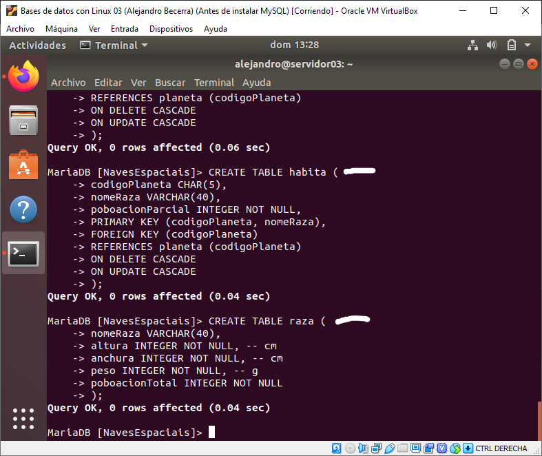

Y por último, alteraremos la tabla raza porque se me olvidó asignarle una clave primaria, luego la interrelación con habita, que antes dio un error porque no tenía establecida la clave primaria de a tabla **raza**.
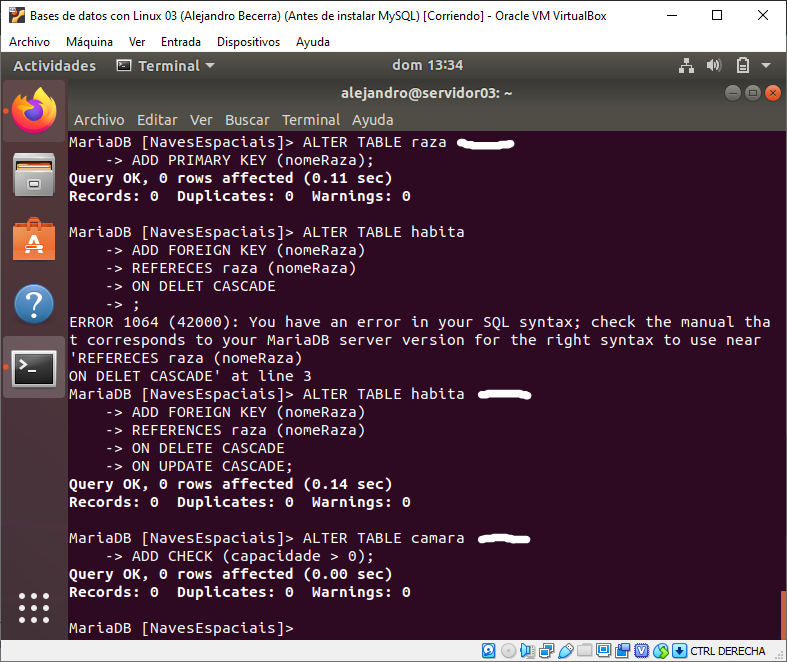
