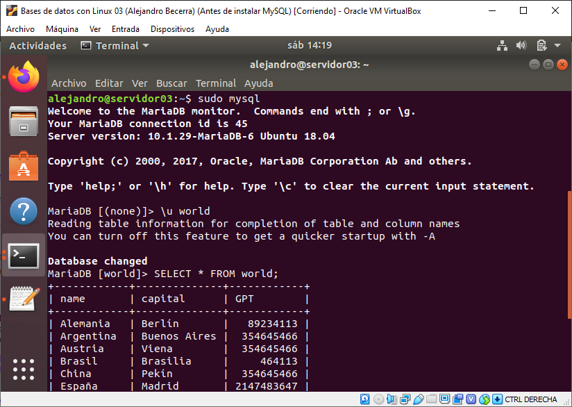
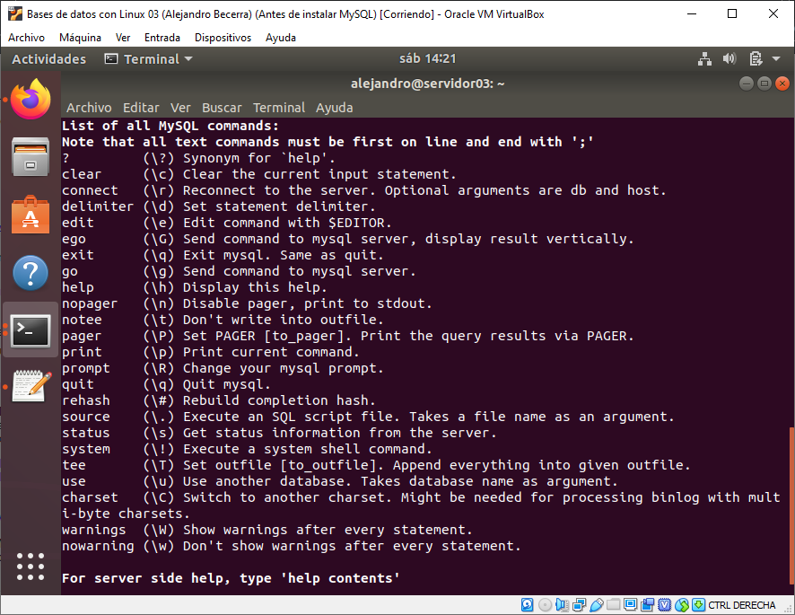

# Apuntes de SQL de Bases de Datos

## Índice

- [Qué es SQL](#Qué-es-SQL)
- [Sublenguajes de SQL](#sublenguajes-de-sql)
- [Cosas a tener en cuenta](#cosas-a-tener-en-cuenta)
- [Como instalar MariaDB en Ubuntu 18.04](#Como-instalar-MariaDB-en-Ubuntu-18-04)
	- [Implantación de dos BD con MariaDB](./ImplementacionConMariaDB.md)
- [Consultas con DQL](./DQL.md#consultas-con-dql)
	- [Estructura básica de una sentencia SQL DQL](./DQL.md#estructura-básica-de-una-sentencia-sql-dql)
	- [Ejemplo práctico 1 (SELECT, FROM, WHERE)](./DQL.md#ejemplo-práctico-1)
	- [Ejemplo práctico 2 (IN)](./DQL.md#ejemplo-práctico-2)
	- [Ejemplo práctico 3 (AS, BETWEEN, ORDER BY)](./DQL.md#ejemplo-práctico-3)
	- [Ejemplos prácticos 4 (LIKE, *%*, *_*)](./DQL.md#ejemplos-prácticos-4)
	- [Ejemplo práctico 5 (REPLACE)](./DQL.md#ejemplo-práctico-5)
	- [Ejemplo práctico 6 (ROUND)](./DQL.md#ejemplo-práctico-6)
	- [Ejemplo práctico 7 (LENGTH)](./DQL.md#ejemplo-práctico-7)
	- [Ejemplo práctico 8 (LEFT, RIGHT)](./DQL.md#ejemplo-práctico-8)
	- [Ejemplo práctico 9 (CONCAT)](./DQL.md#ejemplo-práctico-9)
	- [Ejemplos prácticos 10 (SUM, COUNT, MAX, MIN, AVG, GROUP BY, HAVING)](./DQL.md#ejemplos-prácticos-10)
	- [Ejemplo práctico 11 (JOIN, INNER JOIN)](./DQL.md#ejemplo-práctico-11)
	- [Ejemplo práctico 12(LEFT JOIN, RIGHT JOIN)](./DQL.md#Ejemplo-práctico-12)
- [El sublenguaje DDL](./DDL.md#el-sublenguaje-ddl)
	- [Estructura básica de una setencia DDL con CREATE](./DDL.md#Estructura-básica-de-una-setencia-DDL-con-CREATE)
	- [Ejemplos de creación de una tabla](./DDL.md#Ejemplos-de-creación-de-una-tabla)
- [Creación y modificación de una BD](./DDL.md#Creación-y-modificación-de-una-BD)
	- [Creando la base de datos](./DDL.md#Creando-la-base-de-datos)
	- [Crear los dominios](./DDL.md#Crear-los-dominios)
	- [Creación de las tablas](./DDL.md#Creación-de-las-tablas)
	- [Actualización frente al borrado y a la modificación](./DDL.md#Actualización-frente-al-borrado-y-a-la-modificación)
	- [Como alterar una tabla con ALTER](./DDL.md#Como-alterar-una-tabla-con-ALTER)
- [Como declarar los CONSTRAINTS](./DDL.md#Como-declarar-los-CONSTRAINTS)
	- [Como declarar una clave primaria](./DDL.md#Como-declarar-una-clave-primaria)
	- [Como declarar una clave foránea](./DDL.md#Como-declarar-una-clave-foránea)
	- [Como declarar un atributo único](./DDL.md#Como-declarar-un-atributo-único)
	- [Como declarar una validación con CHECK](./DDL.md#Como-declarar-una-validación-con-CHECK)
- [Como alterar una tabla](./DDL.md#Como-alterar-una-tabla)
- [Como borrar una tabla](./DDL.md#Como-borrar-una-tabla)
- [El sublenguaje DML](./DML.md#El-sublenguaje-DML)
	- [Como usar la sentencia INSERT](./DML.md#Como-usar-la-sentencia-INSERT)
	- [Como usar una setencia UPDATE](./DML.md#Como-usar-una-setencia-UPDATE)
	- [Como usar una setencia DELETE](./DML.md#Como-usar-una-setencia-DELETE)


## Qué es SQL

SQL es un lenguaje declarativo que se usa para gestionar bases de datos relacionales, consta de cinco sublenguajes que hacen posible que se puedan crear bases de datos, insertar datos, crear consultas, modificar permisos de acceso a los datos, borrar tablas...  
	
## Sublenguajes de SQL

En SQL existen seis sublenguajes que que se usan para hacer diferentes cosas, como crear bases de datos, tablas, consultas, modificarlas, hacer transactiones... Los nombres de cada uno son estos y también las setencias más importantes de cada uno.  

- DDL (Data Definition Language) --> CREATE, ALTER, DROP  
- DML (Data Manipulation Lianguage) --> INSERT, UPDATE, DELETE  
- DCL (Data Control Language) --> GRANT, REVOKE, (AUDIT, COMMENT)  
- TCL (Transaction Control Language) --> COMMIT, ROLLBACK, (SAVEPOINT)  
- DQL (Data Query Language) --> SELECT  
- SCL (Sesion Control Language) --> ALTER SESION  

## Cosas a tener en cuenta

1. Los strings **siempre** van entre comillas simples.
2. Por conveinio las clausulas como SELECT, FROM, WHERE... **Van en mayúsculas**.
3. **Siempre se pone punto y coma al final.**
4. Los comentarios de una línea se hacen con -- y lo comentado irá después de los dos guiones.
5. Los comentarios multilínea se hacen con /* */ poniendo el código comentado entre los asteríscos.

## Como instalar MariaDB en Ubuntu 18 04

MariaDB es un **SGBD** (Sistema Gestor de Bases de Datos) relacionales creada en octubre de 2009 que deriva de MySQL, puesto que ambos SGBD fueron fundadas por la misma persona, *Michael Widenius*.  

Solo necesitamos tener un usuario con privilegios de sudo.  

1. Comenzaremos actualizando los paquetes instalados con el comando:  

```sh
~$ sudo apt update
```

-----
2. A continuación instalaremos el servidor de MariaDB.  

```sh
~$ sudo apt install mariad-server
```

-----
3. Y comprobaremos que está bien instalado con:  

```sh
~$ sudo systemctl status mariadb
```

También podemor ver la versión con ```mysql -V``` o ```mysql --version```.  
Y **para ejecutar el programa tendremos que usar privilegios de sudo**, por lo que para abrilo tendremos que usar el comando ```sudo mysql```. Para buscar ayuda tendremos que escribir **\h** y para limpiar la pantalla como si hicieramos clear **\c**. A partir de ahí se pueden crear bases de datos, tablas...  

Aquí dejo dos imágenes de como se debería ver una vez instalado, como se ven las tablas y los argumentos que aparecen cuando pides ayuda.  
Y un link con a implementación de dos bases de datos con MaríaDB en este mismo repositorio, [Implantación de dos BD con MariaDB](./ImplementacioConMariaDB.md).




